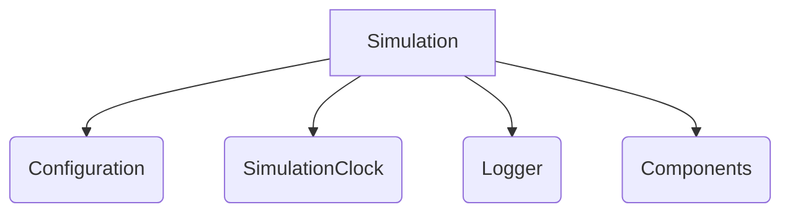
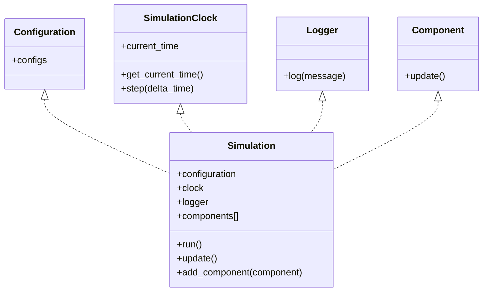

# Simulation
Run a simulation using components in a given time frame

## Class Diagram

## Chain of Events
When the simulation begins it updates all components and logs all updates. Then the clock is updated and the simulation continues until the total duration is reached.