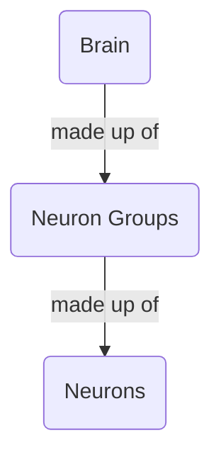
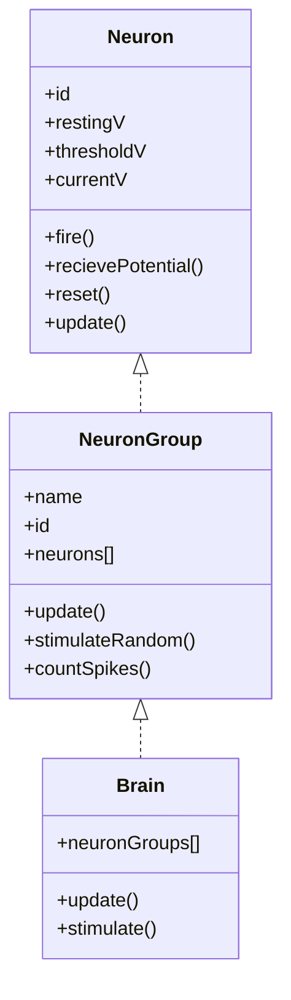

# Brain Simulation Modules
These classes represent portions of the brain that can then be fed to the Simulation class to run simulations

## Class Daigram

## Flow of Events
When the brain is updated it stimulates various neuron groups. A neuron group contains multiple individual neurons. When a neuron group is stimulated it individually updates each neuron possibly cauing them to fire.