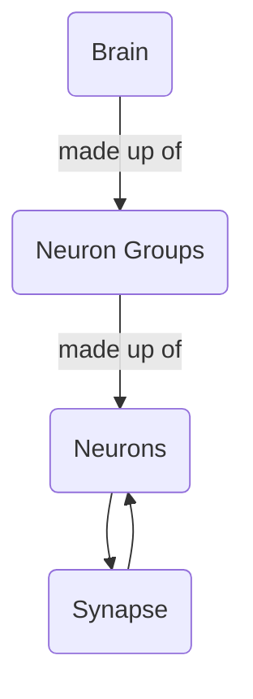
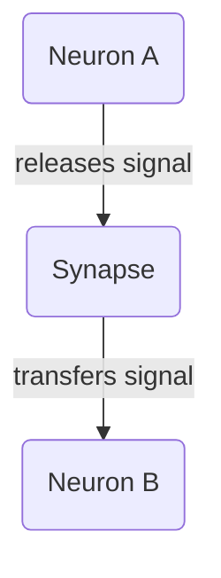
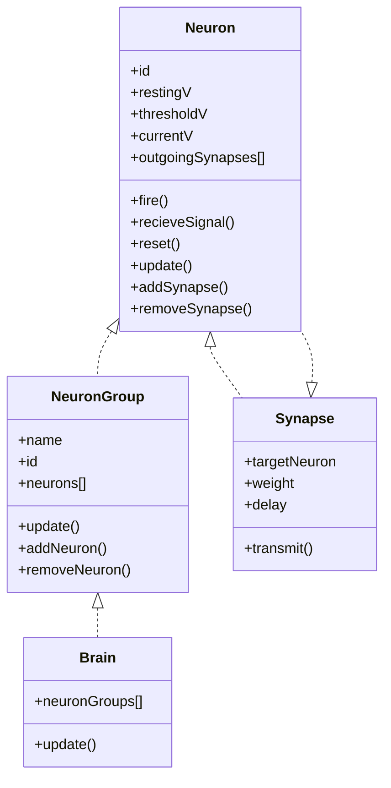

# Brain Simulation Modules
These classes represent portions of the brain that can then be fed to the Simulation class to run simulations
## Composition of the Brain

## Neuron Communication

## Class Daigram

## Flow of Events
When the brain is updated it updates the various neuron groups it contains. A neuron group contains multiple individual neurons. When a neuron group is updated it individually updates each neuron possibly cauing them to fire and stimulate other neurons via a synapse.